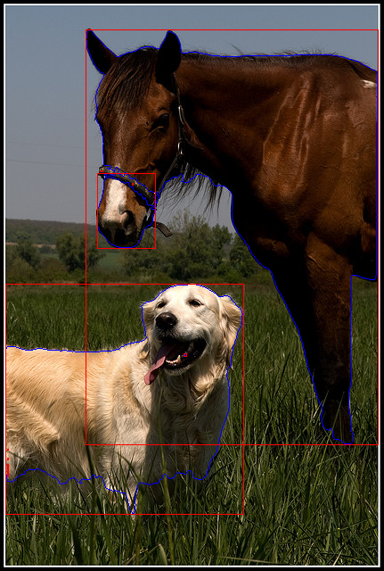

# Using SAM with CLIP for Object Detection Annotation

## ENV
```
pip install -r requirements.txt
```

## Usage

### Processing images under folder
```
python server.py --image-path "path/to/your/image/folder"
```

### As a API Server
```
python server.py --api
```

Using `api_client.py` at remote
```
python api_client.py
```

## Preview


## REF
- https://huggingface.co/spaces/curt-park/segment-anything-with-clip